# The app
{: .no_toc }

The server in this repository is optional. This is the thing it is optional *for*.
{: .fs-5 .fw-300 }

1. TOC
{:toc}

> **The app is in closed testing.** It is not on the App Store yet, and these pages
> describe a build that is still going to TestFlight. The source of the app itself is
> not in this repository — only the backend it can optionally talk to.
{: .note }

## About these pictures

They are taken from the running app on a simulator, by
[`scripts/screenshots.sh`](https://github.com/nordic-sys/helsa) — one launch per screen, no
manual tapping, a fixed random seed. Everything above the data layer is the shipping code: the
same views, the same analysis, the same wording.

**The person in them does not exist.** A fresh simulator's Health database is empty, so the
screens are fed from a generated five-month history rather than from anyone's measurements. The
numbers are lifelike, and none of them are real.

The app ships in **English and Hungarian**, and follows the phone's own language and region —
there is no language switch inside it. Both sets are below, because a translation you cannot see
is a translation nobody checked.

## iPhone — English

| | |
|:--|:--|
| 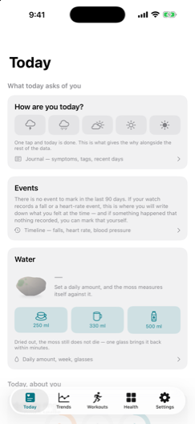 | 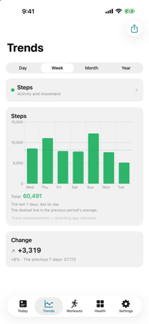 |
| **Today** — the opening tab, four named bands of cards. Every card can be switched off and reordered. | **Trends** — 120 metrics, grouped; day, week, month and year. The dashed line is the previous period. |
| 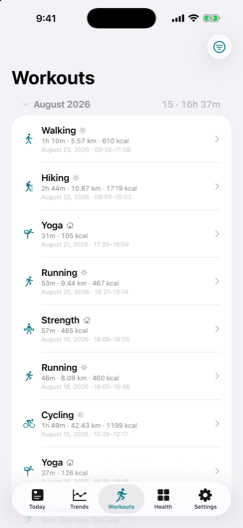 | 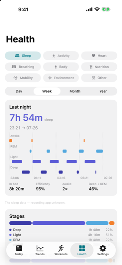 |
| **Workouts** — grouped by month with a count and a total, filterable by type, place, duration, distance, energy and heart rate. | **Sleep** — the night as it was recorded, with stages, efficiency, and the pattern across the period. |
| 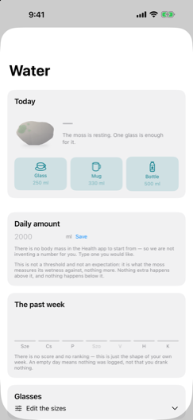 | 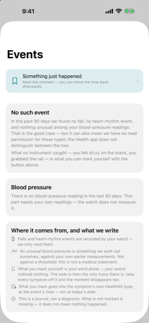 |
| **Water** — the daily amount, and a moss that dries out and comes back. Written to Apple Health, not kept separately. | **Events** — what the watch recorded, and what you felt at the time. The second half is the part no other app keeps. |
| 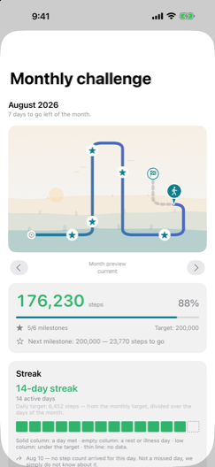 | 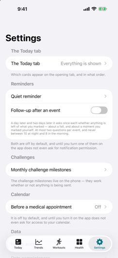 |
| **Challenge** — the monthly streak, with rest days built in rather than bolted on. | **Settings** — everything is off by default, including notifications and the calendar. |

## iPhone — Hungarian

| | |
|:--|:--|
| 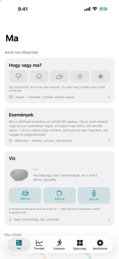 | 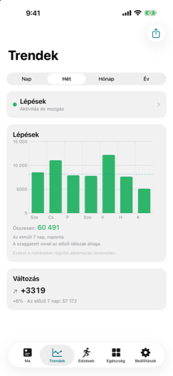 |
| 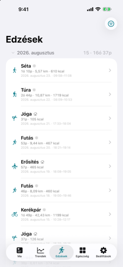 | 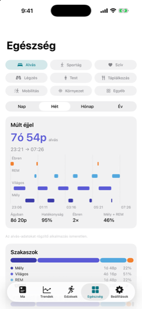 |
| 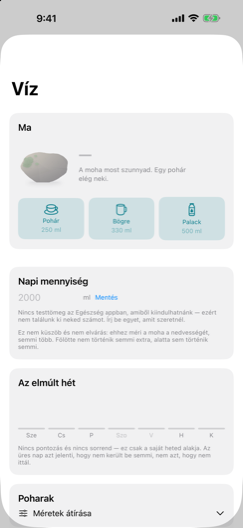 | 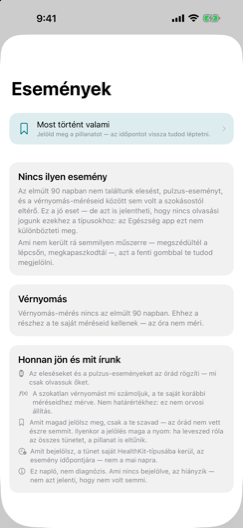 |
| 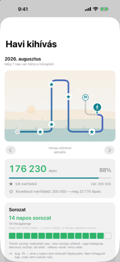 | 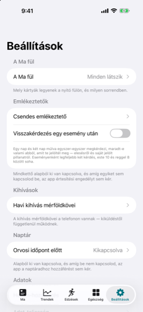 |

## iPad

The iPad shows the same screens with the room to lay them out differently — the tabs move to the
top, and a section that scrolls on the phone fits on one page here.

### English

| | |
|:--|:--|
| 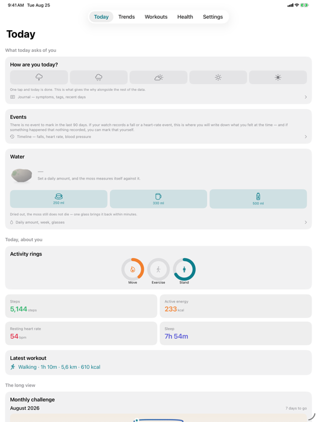 | 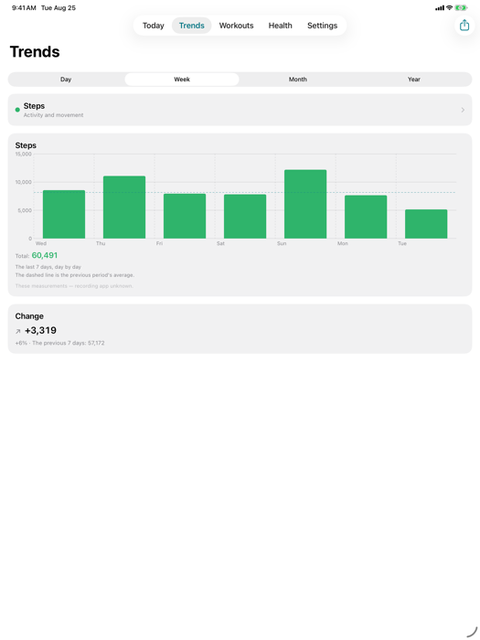 |
| 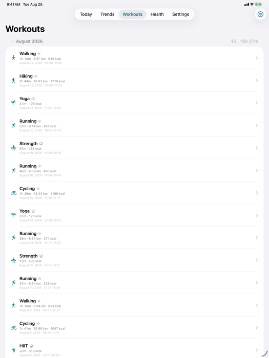 | 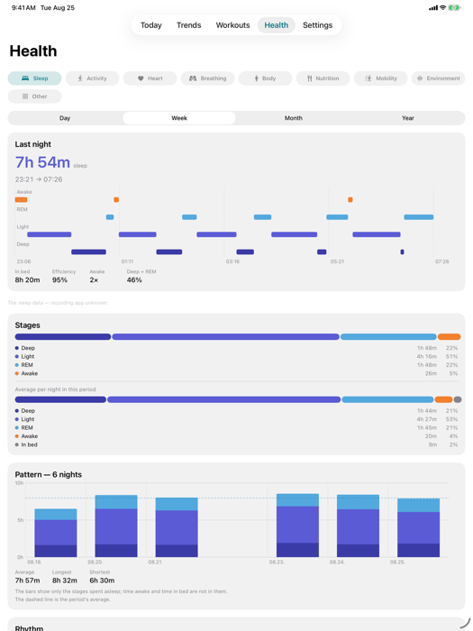 |
| 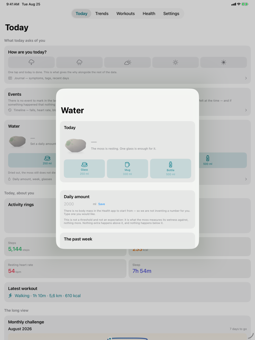 | 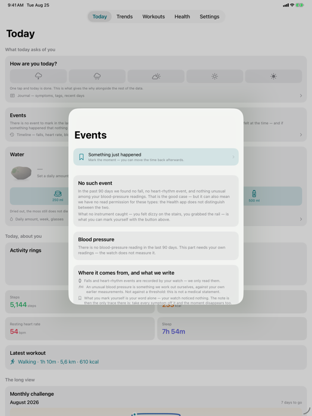 |
| 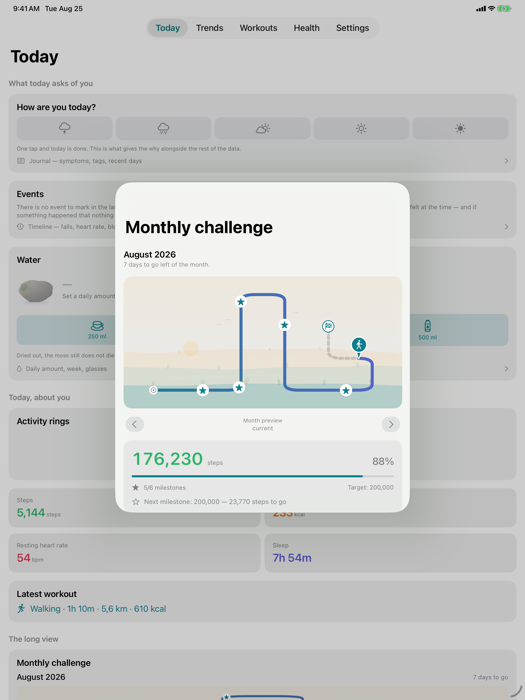 | 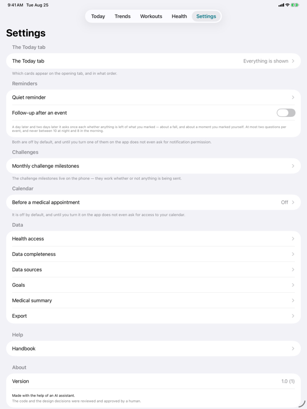 |

### Hungarian

| | |
|:--|:--|
| 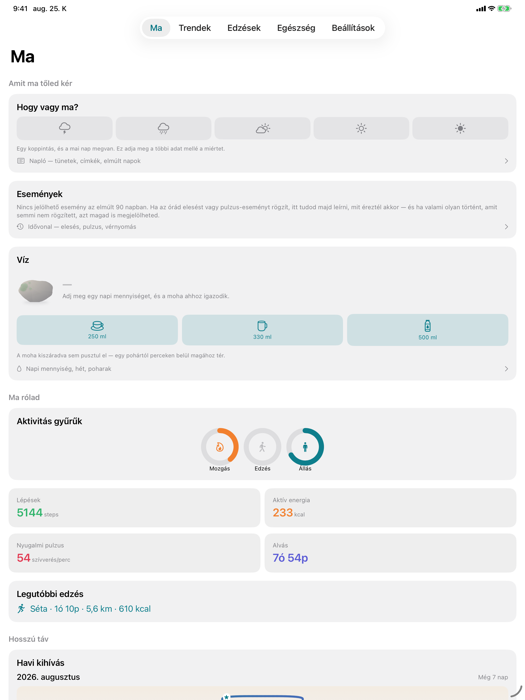 | 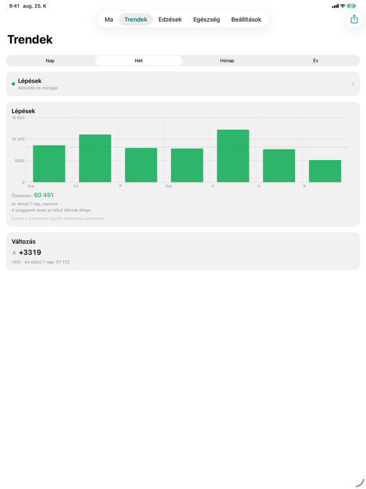 |
| 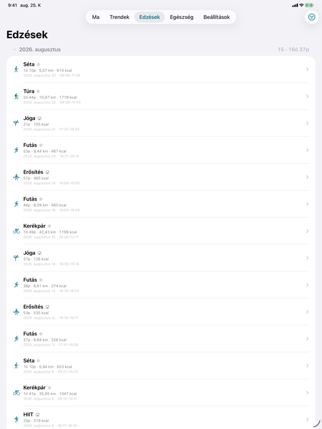 | 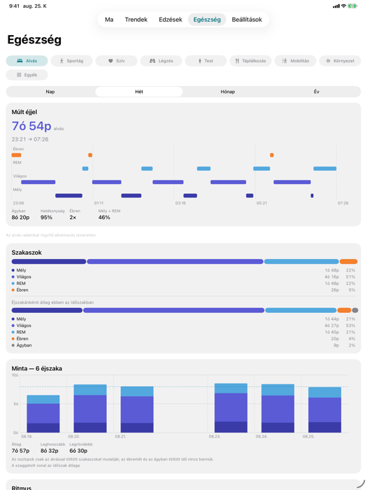 |
| 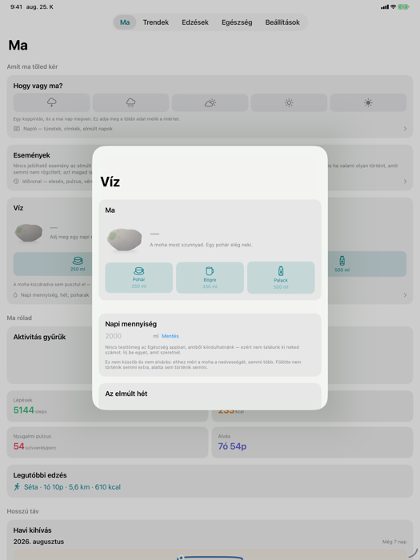 | 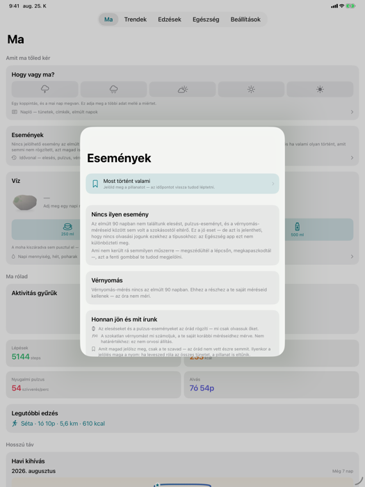 |
| 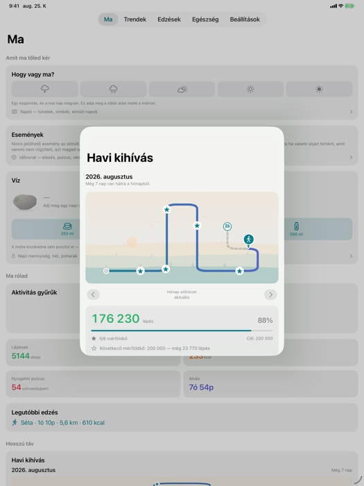 | 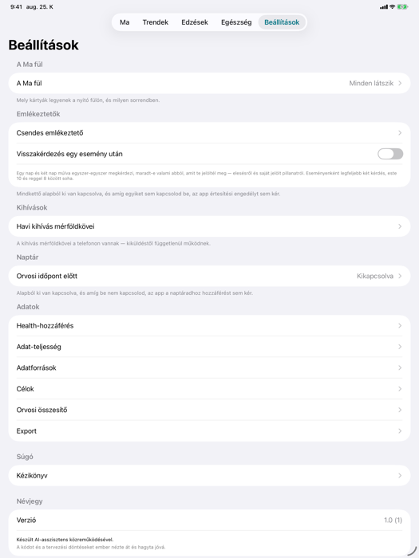 |

## What is not shown here

The Apple Watch app and the complications, because the app has not yet run on a watch — the
minimum is watchOS 26, which needs a Series 6 or newer. The widgets, for the same reason a
widget is hard to photograph honestly: what they show depends on the hour you look.
