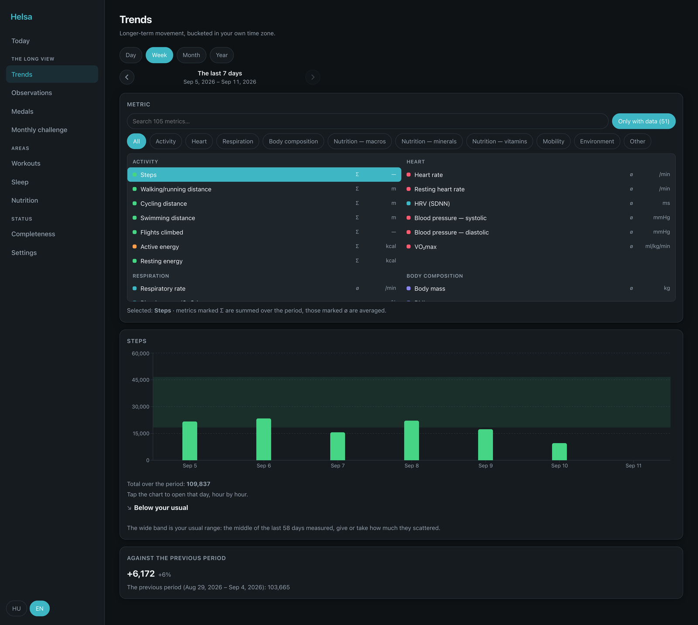

The dashboard is the second way to read what the phone uploaded. It is a full
reader — not a status page — and it is **optional**: the app is complete without
a server at all, and a server is complete without anyone ever opening the
dashboard.

## What it is, and what it is not

- **It reads. It never writes.** The Apple Health data can only come from the
  phone, so the browser has no ingest path and no way to change a measurement.
  Goals and settings are the exception, and they are settings rather than
  measurements.
- **It computes what the app computes**, from the same rules on the server. A
  formula that changes in one place has to be carried to the other: a server that
  computes "your usual range" differently from the phone is worse than one that
  does not compute it, because the two would quietly disagree about the same
  person.
- **It is not a login page.** There is no sign-in because there is no second
  user. Access is two layers that have nothing to do with each other: the network
  (WireGuard) and the application (a device token).

## How to reach it

The dashboard is served by the proxy alongside the API. It is the one component
where the [hardening](/deployment/hardening/) advice is not optional reading:
unlike the API, it is not behind mutual TLS, so **the network layer is the whole
of its front door**.

Point a browser at it from your LAN or over WireGuard, paste a device token once,
and it is stored in that browser only. See
[device token](/getting-started/device-token/).

## How it is organised

Ten pages in three groups, plus the landing page. The grouping is not decoration:
the router is generated from the same list the sidebar is, so a page cannot reach
the web without being handed a group.

| Group | Pages | The claim it makes |
|---|---|---|
| — | **Today** | the landing page: where you are right now |
| **The long view** | Trends · Observations · Medals · Monthly challenge | something to look at, over weeks and months |
| **Areas** | Workouts · Sleep · Nutrition | one domain each, read entry by entry |
| **Status** | Completeness · Settings | whether the thing that moves your data is working |

Two of those group names are taken word for word from the phone's own bands
(`DashboardCard.swift`), because they are claims about the content and the content
is the same.

:::note
**The phone's five tabs are deliberately not copied.** A phone shows one thing at
a time, and a sixth tab would fall into a "More" menu nobody opens. A sidebar
shows all ten links and their headings at once, so the web pays none of that cost
— and copying the compromise would have buried Observations, Medals, the challenge
and Completeness one level down for no reason.
:::

## The layout follows the window

The grid is driven by the width it is actually given, not by device breakpoints.
Narrow windows get one column and the sidebar collapses into a menu; a wide
window gets more columns rather than a two-column layout with a field of empty
space beside it. Wide content — tables, charts, long rows — scrolls inside its own
container, so the page body never scrolls sideways.

## Language

The interface is English and Hungarian, chosen from the browser and switchable.
Every string goes through the translation files; there is no hardcoded interface
text, which is checked rather than trusted.

## What is missing on purpose

- **No analytics, no third-party script, nothing measured.** Same rule as this
  documentation site.
- **No PDF export.** The medical PDF is generated on the phone, where the daily
  journal it draws on lives — and the journal never leaves the device.
- **No notifications.** The quiet reminder is a local notification on the phone.
