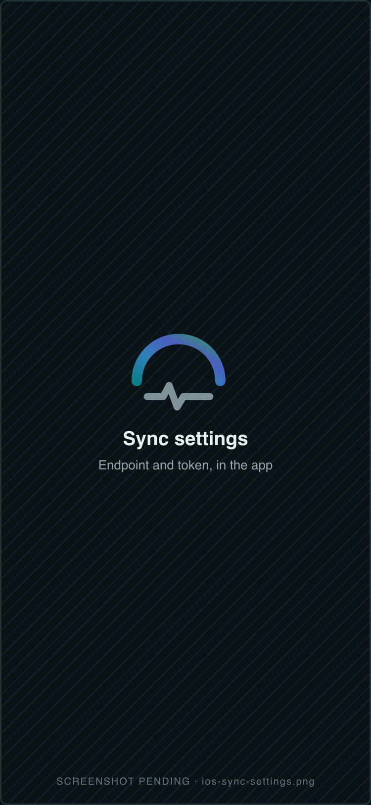
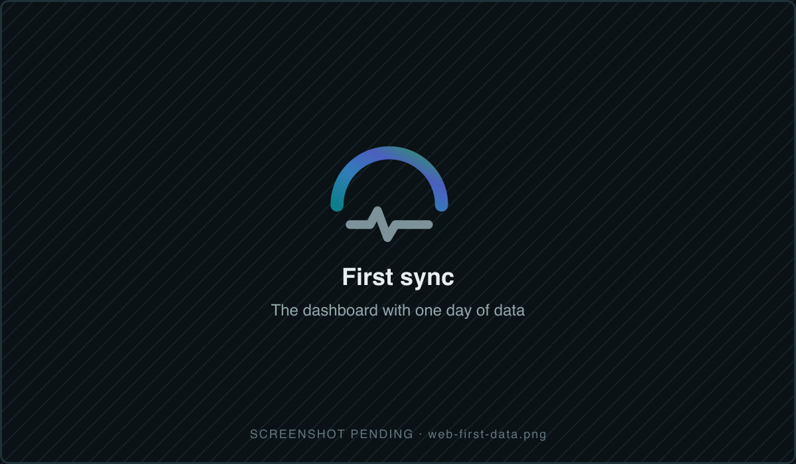

## Before you start

You need a running server ([Quick start](quick-start/)) and a device token
([Device token](device-token/)).

If the phone will reach the server **from outside your home network**, you also
need the certificate work in [TLS and mutual TLS](../deployment/tls-mtls/)
first — the public interface rejects connections without a client certificate at
the TLS handshake, before any token is examined. If the phone is on the same LAN
or on your VPN, you can do a first sync against the LAN interface and add
certificates afterwards.

## Turn on sending

Sending is off until you switch it on. Nothing has been uploaded so far, and if
you never switch it on, nothing ever will be.

In the app's settings, in the section for sending data to your own server:

1. enable sending;
2. enter the **base URL** of your server, including the `/v1` prefix — for example
   `https://helsa.example.net/v1`;
3. paste the **device token**;
4. save, and use the connection test if the app offers one.



> **Screenshot placeholder.** Not in the repository yet — see `docs/SCREENSHOTS.md`
> for what this should show.

:::danger
**Type the URL carefully.** A typo that resolves to somebody else's host means
your health data is offered to that host. The mutual-TLS handshake will fail
against a server that does not have your CA, which limits the damage, but do not
rely on a failure mode as a safety feature — check the hostname.
:::

## What the app does

The first sync is the big one; every later sync is a delta.

1. HealthKit is queried with an **anchored query**. The anchor is an opaque cursor
   meaning "everything up to here has been handled".
2. The delta is cut into **chunks** — a few thousand items each, counting samples,
   workouts, sleep segments, activity summaries, route points, and deletions
   together.
3. Each chunk is `POST`ed to `/v1/ingest`. The server replies `202 Accepted` after
   it has taken the chunk, and processes it asynchronously through the queue.
4. **Only after the `202` does the app advance its anchor**, and only for that
   chunk.

That last point is the whole design. If the connection dies mid-upload, the anchor
still points at the last acknowledged chunk, so the next attempt resumes there —
nothing is lost, nothing is uploaded twice in a way that matters. Ingestion is
idempotent anyway: every item carries its HealthKit `source_uuid`, which is the
deduplication key.

A phone that has been offline for weeks catches up by repeating this loop.
Details: [API — Ingest](../api/ingest/).

## Verify it landed

**Did a device register?**

```bash
curl -s -H "Authorization: Bearer $TOKEN" \
  http://127.0.0.1:8080/v1/devices | jq
```

You should see one entry with a recent `last_seen_at`. That timestamp is also what
the [staleness alert](../integrations/home-assistant/#the-alert-that-matters)
watches.

**Did samples arrive?**

```bash
curl -s -H "Authorization: Bearer $TOKEN" \
  'http://127.0.0.1:8080/v1/summary?range=week&metrics=stepCount,heartRate&tz=Europe/Budapest' | jq
```

**What does the database say?**

```bash
docker compose exec timescaledb psql -U helsa -d helsa -c \
  "SELECT data_type, count(*), min(ts), max(ts) FROM samples GROUP BY 1 ORDER BY 2 DESC;"
```

**Is the worker keeping up?**

```bash
docker compose logs -f worker
```

The worker logs per-batch counts: items processed, duplicates skipped, dead-lettered
messages. A growing queue with an idle worker means the worker cannot reach the
database or the broker — check `/readyz`.



> **Screenshot placeholder.** Not in the repository yet — see `docs/SCREENSHOTS.md`.

## When it does not work

| Symptom | Likely cause | Fix |
|---|---|---|
| App reports a TLS or "cannot connect" error | The CA certificate is installed on the phone but **not trusted**. Installing a root CA and trusting it are two separate steps on iOS. | Settings → General → About → Certificate Trust Settings, and enable it. See [TLS and mutual TLS](../deployment/tls-mtls/#installing-on-the-phone). |
| Connection refused at the TLS handshake, no HTTP status | No client certificate, or one signed by a different CA. | Reimport the `.p12`. Confirm with `openssl verify -CAfile ca.crt client.crt`. |
| `401` | Token missing, mistyped, revoked, or signed with a different `HELSA_JWT_SECRET`. | Issue a fresh token and paste it again. |
| `413` | The chunk exceeded the server limit. | The app should shrink its chunk and retry; the `202` body advertises `max_items`. If it persists, the client-side chunk size is too large. |
| `202` but nothing in the database | The worker is down, or the queue is unreachable. | `docker compose ps`, `docker compose logs worker`, `curl /readyz`. |
| Data arrives but daily totals look wrong | Time zone. Daily buckets are computed in a specific zone. | Set `time_zone` in settings to a valid IANA zone, or pass `tz=` explicitly. See [API conventions](../api/#conventions). |
| Steps look roughly doubled | Both the iPhone and the Watch recorded them. | Expected in the raw `samples` table, which keeps the source. Aggregates use HealthKit's deduplicated statistics. |

## Then what

- The phone keeps syncing in the background. It does not need you.
- Point a browser at the dashboard from your LAN or VPN.
- Set up the [staleness alert](../integrations/home-assistant/) — this system's
  characteristic failure is not a crash but silence, and silence is invisible
  unless something watches for it.
- Take a backup and **restore it once** before you trust the setup:
  [Backups and restore](../deployment/backups/).
